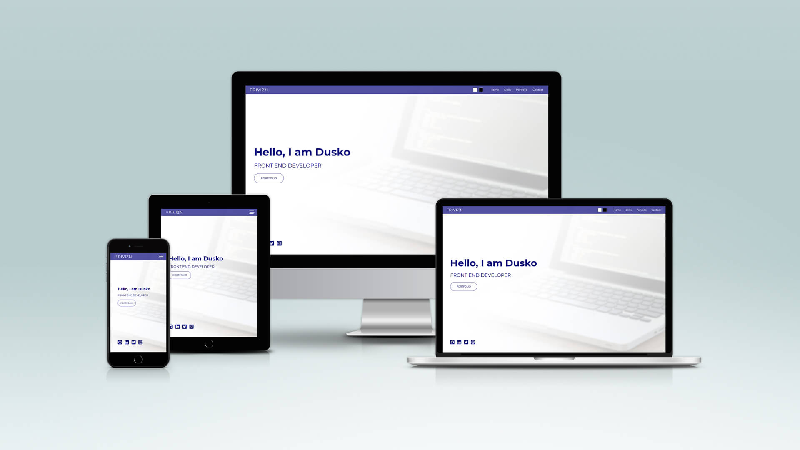

# Web Developer Portfolio

Responsive web developer portfolio with light and dark themes.

[]

[^bignote]: I've used Sass Extension in VS Code which automatically created css files (css/style.css and dist/style.min.css), 
but for the purpose of changing themes I've created two separated css files by "hand" (css/light-theme.css and css/dark-theme.css).

There are also minified versions done with CSS Minifier (css/light-theme.min.css and css/dark-theme.min.css).
